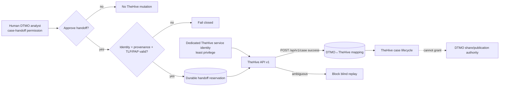

# DTMO Security Overview

Last updated: **2026-08-17**  
Software baseline: **16.0.0rc12 plus accepted post-RC13/E8/Phase-11 repository enhancements**

## Security objectives

DTMO protects confidentiality, integrity, availability, provenance, accountability and controlled dissemination of cyber threat intelligence. Security controls keep source trust, identity, authorization, evidence and human decision boundaries explicit and enforceable.

DTMO is **not production authorized**. Phase 10 concluded `NO-GO / BLOCKED — PLATFORM INDUSTRIALISATION REQUIRED`; Phase 11 is `IN PROGRESS / ACTIVE`. Phase 11.1–11.5 are `PASS / REPOSITORY_COMPLETE`. The active bounded gate is **Phase 11.6 TheHive incident/case handoff contract**.

## Identity and access control

- Server-side RBAC is authoritative.
- Human and service-account authorities remain separated.
- Least privilege and explicit role/permission scope are enforced server-side.
- Service accounts, connectors, schedulers and integrated platforms do not receive human review/share-approval or case-handoff authority.
- External Phase 11 services use dedicated non-human identities with minimum required scope.
- Runtime secrets are never stored in repository evidence, logs or screenshots.
- Authentication/authorization failures fail closed and never trigger privilege broadening.

## Separation of duties and publication authority

Technical success is not dissemination or incident-escalation authority. Taranis publisher state, IntelOwl results, OpenCTI graph content, MISP ingest/delivery success and TheHive case state do **not** authorize DTMO external sharing or publication. Human review and governed DTMO share approval remain authoritative. TheHive case-handoff approval is a separate human authority.

## Accepted Phase 11 service boundaries

Phase 11.3 IntelOwl remains a separate AGPL-3.0 service/API boundary. Phase 11.4 OpenCTI remains a separate service/API boundary with Community Apache-2.0 and separately licensed Enterprise features. Phase 11.5 MISP remains a separate AGPL-3.0 service/API boundary with authoritative distribution/sharing-group/TLP restrictions and human-approved unpublished export.

None of these services independently establishes DTMO-local exploitability, exposure or compromise.

## Phase 11.6 TheHive security boundary

Reviewed upstream baseline: **TheHive 5.5.16**, public API v1 (`/api/v1`). TheHive remains a separate StrangeBee service. DTMO does not vendor TheHive source or treat repository integration as license entitlement.

TheHive 5.3+ requires an activated Community, Gold or Platinum license for continued write functionality. Any future deployed case-creation validation must verify the actual entitlement and quota rather than infer it from CI.

The initial mutation candidate is `POST /api/v1/case`, but it is not authorized by source ingestion, enrichment, graph presence, MISP exchange or scheduler execution. It requires explicit human-approved DTMO case handoff under dedicated server-side RBAC.

Security invariants:

- case-handoff authority is distinct from publication/share authority;
- routine integration uses a dedicated non-human TheHive identity scoped to the approved organization and minimum accepted API permissions;
- platform administration, organization administration, ownership transfer, external sharing, responders, Cortex execution and arbitrary bulk mutations are excluded;
- DTMO canonical UUID, handoff request/idempotency identity, TheHive case identity and organization context must be durably mapped before retries are permitted;
- mutable titles, descriptions, tags, assignees and status values are not identity;
- TLP/PAP/access mapping must preserve the strongest authoritative source restriction and unknown or unrepresentable restrictions fail closed;
- attachments, raw source bodies, credentials, private enrichment results and unrelated personal data are excluded by default;
- `401`, `403`, read-only/license failure, organization mismatch and malformed API responses fail closed;
- ambiguous mutation delivery blocks blind replay and requires reconciliation;
- TheHive unavailability must not make unrelated DTMO read paths unavailable;
- TheHive case state does not become canonical CTI truth, local-compromise proof or DTMO external-share authority.

## Data protection and privacy

TheHive case records may contain sensitive incident context and personal data. DTMO applies purpose limitation, minimization, source handling restrictions and existing retention/governance controls. Technical reachability or API permission does not establish lawful authority to send data.

- Only analyst-approved, case-relevant data may cross the boundary.
- Apply the strongest applicable TLP/PAP/access restriction.
- Avoid raw source bodies and unnecessary personal data.
- Never transmit or persist credentials in case content.
- Preserve DTMO provenance and a traceable canonical reference.

## Persistence, auditability and integrity

PostgreSQL remains canonical DTMO application/RBAC/intelligence state. TheHive is authoritative only for its case lifecycle after an accepted handoff. A later implementation must persist reservation/mapping state sufficient to prevent duplicate case creation under retry ambiguity and must retain actor, request, canonical item and TheHive outcome attribution without exposing secrets.

## Supply chain and licensing security

- Exact-head CI is required before protected merge; a new commit invalidates earlier exact-head evidence.
- DTMO is Apache-2.0.
- IntelOwl/pyIntelOwl and MISP remain separate AGPL-3.0 services.
- OpenCTI Community Edition is Apache-2.0; Enterprise Edition is separately licensed.
- TheHive is a separate licensed StrangeBee service; Community/Gold/Platinum entitlement must be verified for the deployed instance.
- Source vendoring, bundling or redistribution of upstream components requires explicit licensing/legal review.
- Repository CI is engineering evidence only and does not establish production authorization.

## Evidence boundary

The Phase 11.6 contract can establish repository evidence for policy/documentation consistency only. It cannot establish live TheHive connectivity, effective service-account permissions, license entitlement, organization/access configuration, privacy approval, real-data TLP/PAP correctness, HA/recovery, production-equivalent validation, independent assurance or production authorization.

Historical Phase 8/9 evidence remains candidate-bound. Fresh Phase 11.10 and 11.11 evidence is required for the integrated Phase 11 candidate before Phase 12.
