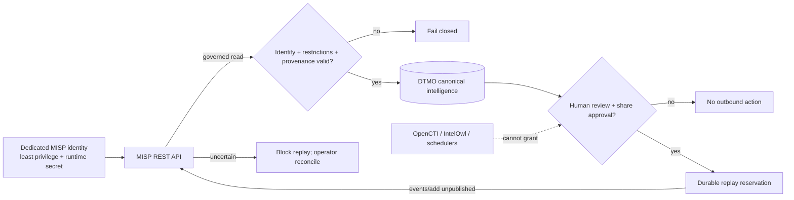

# DTMO Security Overview

Last updated: **2026-08-16**  
Software baseline: **16.0.0rc12 plus accepted post-RC13/E8/Phase-11 repository enhancements**

## Security objectives

DTMO protects confidentiality, integrity, availability, provenance, accountability and controlled dissemination of cyber threat intelligence. Security controls keep source trust, identity, authorization, evidence and human decision boundaries explicit and enforceable.

DTMO is **not production authorized**. Phase 10 concluded `NO-GO / BLOCKED — PLATFORM INDUSTRIALISATION REQUIRED`; Phase 11 is `IN PROGRESS / ACTIVE`. Phase 11.1–11.2 Taranis, Phase 11.3 IntelOwl and Phase 11.4 OpenCTI are `PASS / REPOSITORY_COMPLETE`. The active bounded gate is **Phase 11.5 MISP consolidation contract validation**.

## Identity and access control

- Server-side RBAC is authoritative.
- Human and service-account authorities remain separated.
- Least privilege and explicit role/permission scope are enforced server-side.
- Service accounts, connectors, schedulers and integrated platforms do not receive human review/share-approval authority.
- External Phase 11 services use dedicated non-human identities with minimum required scope.
- Runtime secrets are never stored in repository evidence, logs or screenshots.
- Authentication/authorization failures fail closed and never trigger privilege broadening.

## Separation of duties and publication authority

Technical success is not dissemination authority. Taranis publisher state, IntelOwl analyzer/job results, OpenCTI graph content and MISP ingest/delivery success do **not** authorize DTMO external sharing or publication. Human review and governed DTMO share approval remain authoritative.

## Threat and vulnerability management

DTMO keeps threat-intelligence context, vulnerability evidence and local exposure/compromise claims separate. External source presence, IntelOwl analyzer output, OpenCTI graph relationships, MISP event membership or upstream confidence never by themselves establish DTMO-local exploitability, exposure or compromise. Vulnerability and threat decisions remain provenance-backed, governed and subject to the existing DTMO review and prioritization controls.

This boundary preserves the established Normenkader IBP SM.07-oriented threat and vulnerability management evidence model without turning an integration result or framework mapping into a blanket compliance or maturity claim.

## Phase 11.3 IntelOwl boundary

Phase 11.3 is `PASS / REPOSITORY_COMPLETE`. IntelOwl remains a separate AGPL-3.0 service/API boundary with explicit analyzer allowlists, runtime-secret token handling, durable attribution and no-share/no-local-compromise invariants.

## Phase 11.4 OpenCTI boundary

Phase 11.4 is `PASS / REPOSITORY_COMPLETE`. OpenCTI remains a separate service/API boundary. Community Edition is Apache-2.0; Enterprise Edition is separately licensed. The accepted DTMO path preserves OpenCTI/STIX identity, markings/TLP/PAP, confidence and provenance, stores immutable reconciliation history and commits PostgreSQL before checkpoint advance. Graph presence never grants DTMO share authority or proves local compromise.

## Phase 11.5 MISP security boundary

Reviewed upstream baseline: **MISP v2.5.44**. MISP core remains a separate **AGPL-3.0** service/API component. DTMO does not vendor, fork, embed or redistribute MISP core source as part of Phase 11.5.

The existing inbound and outbound capabilities are consolidated under one authority model:

- inbound `POST /events/restSearch` is read-oriented and preserves event/attribute/object UUID identity, organisation, distribution, sharing-group, TLP/tag, galaxy and provenance data;
- outbound `POST /events/add` requires attributable human DTMO review/share approval and creates an unpublished destination event;
- MISP-origin distribution, sharing-group and TLP restrictions are authoritative constraints and cannot be broadened on re-export;
- MISP import does not set DTMO `share_approved`, publication authority or local-compromise proof;
- service accounts, collectors, schedulers, IntelOwl, OpenCTI and MISP itself cannot grant DTMO sharing authority;
- deterministic event UUID/replay reservations prevent blind duplicate delivery;
- uncertain remote delivery blocks automatic replay pending operator reconciliation;
- MISP server push/pull synchronization and OpenCTI↔MISP automatic synchronization are excluded from this contract slice;
- production MISP API access requires HTTPS/certificate validation and a dedicated minimum-capability runtime identity;
- `401`/`403`, ambiguous UUID mappings, malformed restrictions and contradictory provenance fail closed.

## Data protection and privacy

MISP can contain personal data and sensitive operational context. DTMO applies data minimization, source handling restrictions and existing retention/governance controls. Technical reachability or API permission does not establish lawful authority to collect or redistribute data.

- Collect and retain only data needed for the defined intelligence purpose.
- Preserve source, enrichment, graph and MISP provenance/confidence/restriction context.
- Avoid unnecessary personal data in logs and retained evidence.
- Do not commit secret values, credentials or bearer tokens.
- Apply the strongest applicable handling/share restriction across integrations.

## Persistence and integrity

PostgreSQL remains canonical DTMO application/RBAC/intelligence state. OpenSearch, object storage, Redis and observability stores remain supporting services. Taranis, IntelOwl, OpenCTI and MISP remain separate application services and do not silently replace DTMO canonical truth.

The accepted OpenCTI persistence model remains unchanged. The next Phase 11.5 implementation slice may add reconciled MISP synchronization state/persistence only after the contract is accepted; any such state must be restart-safe, idempotent and subordinate to source restrictions and human authority.

## Auditability and observability

Security-relevant activity retains actor/principal identity, action/resource context, request/correlation identity and attributable outcomes without exposing raw credentials. MISP outbound evidence must retain replay/destination identity and distinguish `pending`, `success` and `uncertain` outcomes.

## Supply chain and licensing security

- Exact-head CI is required before protected merge; a new commit invalidates earlier exact-head evidence.
- DTMO is Apache-2.0.
- IntelOwl/pyIntelOwl remain separate AGPL-3.0 services.
- OpenCTI Community Edition is Apache-2.0; Enterprise Edition is separately licensed.
- MISP core remains a separate AGPL-3.0 service/API boundary.
- Source vendoring, modified network-service operation, bundling or redistribution of upstream components requires explicit licensing/legal review where applicable.
- Repository CI is engineering evidence only and does not establish production authorization.
