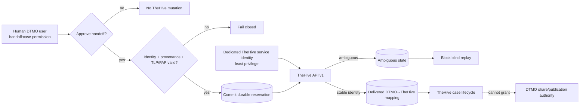

# DTMO Security Overview

Last updated: **2026-08-17**  
Software baseline: **16.0.0rc12 plus accepted post-RC13/E8/Phase-11 repository enhancements**

## Security objectives

DTMO protects confidentiality, integrity, availability, provenance, accountability and controlled dissemination of cyber threat intelligence. Security controls keep source trust, identity, authorization, evidence and human decision boundaries explicit and enforceable.

DTMO is **not production authorized**. Phase 10 concluded `NO-GO / BLOCKED — PLATFORM INDUSTRIALISATION REQUIRED`; Phase 11 is `IN PROGRESS / ACTIVE`. Phase 11.1–11.5 and the Phase 11.6 TheHive contract are `PASS / REPOSITORY_COMPLETE`. The active bounded gate is the **Phase 11.6 human-authorized TheHive case-handoff implementation**.

## Identity and access control

- Server-side RBAC is authoritative.
- Human and service-account authorities remain separated.
- Least privilege and explicit role/permission scope are enforced server-side.
- `handoff:case` is a dedicated human permission and is separate from `approve:share`.
- CISO, CERT, Senior Analyst and Administrator roles receive bounded case-handoff authority; Publisher alone does not.
- Service accounts, connectors, schedulers and integrated platforms do not receive human review/share-approval or case-handoff authority.
- TheHive runtime mutation uses a dedicated non-human identity only after DTMO human authorization.
- Runtime secrets are never stored in repository evidence, logs or screenshots.
- Authentication/authorization failures fail closed and never trigger privilege broadening.

## Separation of duties and publication authority

Technical success is not dissemination or incident-escalation authority. Taranis publisher state, IntelOwl results, OpenCTI graph content, MISP ingest/delivery success and TheHive case state do **not** authorize DTMO external sharing or publication. Human review and governed DTMO share approval remain authoritative. TheHive case-handoff approval is a separate human authority.

## Threat and vulnerability management

DTMO threat and vulnerability management keeps CTI, enrichment, vulnerability context and local security conclusions separate and provenance-backed. Taranis, IntelOwl, OpenCTI and MISP may contribute source, enrichment, graph or exchange context, but none of those external service results independently proves DTMO-local exposure, exploitability, compromise or attribution certainty. Vulnerability prioritization and governance mappings therefore remain explicit, reviewable and bounded to the evidence available to DTMO.

Phase 11 integration changes preserve this governance boundary: service-to-service processing cannot grant publication/share authority, case-handoff authority or local-compromise status. Missing, conflicting or unrepresentable security evidence fails closed rather than being inferred.

## Accepted Phase 11 service boundaries

Phase 11.3 IntelOwl remains a separate AGPL-3.0 service/API boundary. Phase 11.4 OpenCTI remains a separate service/API boundary with Community Apache-2.0 and separately licensed Enterprise features. Phase 11.5 MISP remains a separate AGPL-3.0 service/API boundary with authoritative distribution/sharing-group/TLP restrictions and human-approved unpublished export. Phase 11.6 keeps TheHive as a separate StrangeBee service/API boundary with deployment-specific license entitlement.

None of these services independently establishes DTMO-local exploitability, exposure or compromise.

## Phase 11.6 TheHive security boundary

Reviewed upstream baseline: **TheHive 5.5.16**, public API v1 (`/api/v1`). TheHive remains a separate StrangeBee service. DTMO does not vendor TheHive source or treat repository integration as license entitlement.

The active repository implementation allows only an explicit human-authorized `POST /api/v1/case` mutation. `DTMO_FEATURE_THEHIVE_HANDOFF` is disabled by default. Production configuration requires an HTTPS API base, runtime token and explicit organization when enabled, but repository validation does not prove the actual tenant entitlement or permission scope.

Security invariants:

- `handoff:case` authority is distinct from publication/share authority;
- routine integration uses a dedicated non-human TheHive identity scoped to the approved organization and minimum accepted API permissions;
- the service identity cannot authorize the human handoff itself;
- platform administration, organization administration, ownership transfer, external sharing, responders, Cortex execution, task/observable creation, case deletion and arbitrary bulk mutations are excluded;
- canonical item identity and repository provenance are required before mutation;
- deterministic severity and explicit TLP/PAP mappings are required and unknown values fail closed;
- a durable reservation is committed before the external request;
- DTMO canonical UUID, handoff request/idempotency identity, human principal, TheHive case identity and organization context are durably mapped;
- mutable titles, descriptions, tags, assignees and status values are not identity;
- attachments, raw source bodies, credentials, private enrichment results and unrelated personal data are excluded by default;
- authentication/authorization/write-boundary failures do not trigger privilege broadening;
- timeout/network ambiguity or nominal success without stable identity creates an `ambiguous` state;
- ambiguous mutation delivery blocks blind replay and requires reconciliation;
- database constraints enforce `external_share_authorized=false` and `local_compromise_proven=false` on handoff state;
- TheHive unavailability must not make unrelated DTMO read paths unavailable;
- TheHive case state does not become canonical CTI truth, local-compromise proof or DTMO external-share authority.

## Data protection and privacy

TheHive case records may contain sensitive incident context and personal data. DTMO applies purpose limitation, minimization, source handling restrictions and existing retention/governance controls. Technical reachability or API permission does not establish lawful authority to send data.

- Only analyst-approved, case-relevant summary data may cross the boundary.
- Apply explicit effective TLP/PAP; uncertain mappings block the handoff.
- Avoid raw source bodies and unnecessary personal data.
- Never transmit or persist credentials in case content.
- Preserve a traceable DTMO canonical UUID reference.
- Attachments and private enrichment results are outside this slice.

## Persistence, auditability and integrity

PostgreSQL remains canonical DTMO application/RBAC/intelligence state. TheHive is authoritative only for its case lifecycle after an accepted handoff.

Migration `0014_thehive_handoff_state` adds durable mutation reservation/reconciliation state. Database constraints preserve unique request identity, unique confirmed TheHive case identity, bounded lifecycle states and hard no-share/no-local-compromise invariants. The repository commits `reserved` before external mutation; confirmed stable identity becomes `delivered`; uncertain delivery becomes `ambiguous`; definitive bounded failures become `failed`.

Actor, request, canonical item, organization, authority envelope and sanitized outcome are attributable without persisting the runtime token.

## Supply chain and licensing security

- Exact-head CI is required before protected merge; a new commit invalidates earlier exact-head evidence.
- DTMO is Apache-2.0.
- IntelOwl/pyIntelOwl and MISP remain separate AGPL-3.0 services.
- OpenCTI Community Edition is Apache-2.0; Enterprise Edition is separately licensed.
- TheHive is a separate licensed StrangeBee service; Community/Gold/Platinum entitlement must be verified for the deployed instance.
- Source vendoring, bundling or redistribution of upstream components requires explicit licensing/legal review.
- Repository CI is engineering evidence only and does not establish production authorization.

## Evidence boundary

The Phase 11.6 implementation can establish synthetic repository evidence for route, RBAC, persistence, state-machine, migration and documentation consistency only. It cannot establish live TheHive connectivity, effective service-account permissions, license entitlement, organization/access configuration, privacy approval, real-data TLP/PAP correctness, HA/recovery, production-equivalent validation, independent assurance or production authorization.

Historical Phase 8/9 evidence remains candidate-bound. Fresh Phase 11.10 and 11.11 evidence is required for the integrated Phase 11 candidate before Phase 12.
