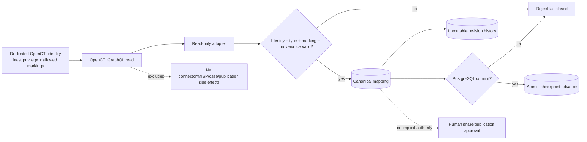

# DTMO Security Overview

Last updated: **2026-08-16**  
Software baseline: **16.0.0rc12 plus accepted post-RC13/E8/Phase-11 repository enhancements**

## Security objectives

DTMO protects confidentiality, integrity, availability, provenance, accountability and controlled dissemination of cyber threat intelligence. Security controls keep source trust, identity, authorization, evidence and human decision boundaries explicit and enforceable.

DTMO is **not production authorized**. Phase 10 concluded `NO-GO / BLOCKED — PLATFORM INDUSTRIALISATION REQUIRED`; Phase 11 is active. Phase 11.1–11.2 Taranis and Phase 11.3 IntelOwl are repository-complete. The Phase 11.4 OpenCTI contract and read-only adapter are `PASS / REPOSITORY_COMPLETE`; the active bounded gate is **OpenCTI canonical mapping/persistence + operational integration**.

## Identity and authentication

External Phase 11 services use dedicated non-human identities with minimum required scope. OpenCTI routine integration requires only the knowledge/read capabilities and allowed markings needed by the bounded path. Administrator authority, `Bypass all capabilities` and connector capabilities are not routine requirements. `401`/`403` never trigger privilege broadening.

## Identity and access control

- Server-side RBAC is authoritative.
- Human and service-account authorities remain separated.
- Least privilege and explicit role/permission scope are enforced server-side.
- Service accounts/connectors do not receive human review/share-approval authority.
- Governed IntelOwl execution requires `REVIEW_INTELLIGENCE`; IntelOwl history reads require `READ_INTELLIGENCE`.
- OpenCTI access is bounded by OpenCTI capabilities and marking/data-segregation controls.
- Privileged Administration remains human-authorized and auditable.

## Separation of duties and publication authority

Technical success is not dissemination authority. Taranis publisher state, IntelOwl analyzer/job results and OpenCTI entities, mappings, revisions, relationships, confidence or connector capabilities do **not** authorize DTMO external sharing or publication. Existing human approval and governed export/MISP controls remain authoritative.

## Source and ingestion security

Credentialed integrations use runtime secret references; raw API keys, passwords or bearer tokens are not stored as repository/catalog evidence. Canonical ingestion and graph reconciliation preserve attributable evidence and require durable persistence before success is reported.

## Threat and vulnerability management

DTMO threat and vulnerability management preserves source provenance, separates external intelligence from local exposure evidence, and keeps CVE/CVSS/EPSS/KEV, enrichment and graph signals attributable rather than treating them as proof of local compromise. Phase 11 integrations extend this evidence model without weakening human review, RBAC, privacy/TLP or publication authority.

## Phase 11.3 IntelOwl enrichment security boundary

The IntelOwl service/API/security/licensing contract, bounded adapter and governed execution/persistence path are repository-complete. The accepted path preserves analyzer allowlists, HTTPS/token requirements, bounded polling/result validation, `connectors_requested=[]`, durable job attribution and database-enforced `external_share_authorized=false` / `local_compromise_proven=false` invariants.

IntelOwl remains a separate AGPL-3.0 service. Repository acceptance does not prove live provider connectivity, production credentials, analyzer quality, privacy approval or production authorization.

## Phase 11.4 OpenCTI security boundary

The reviewed baseline remains OpenCTI 7.260811.0. DTMO consumes OpenCTI as a separate service/API boundary. Community Edition is Apache-2.0; Enterprise Edition is separately licensed and Enterprise-only dependencies require explicit entitlement/legal review.

The read path remains GraphQL `stixCoreObjects` only. The active persistence slice introduces `opencti_object_mappings` and immutable `opencti_mapping_revisions`. Stable OpenCTI internal identity and STIX identity are both retained; conflicting identity drift fails closed rather than being heuristically merged.

Required controls:

- DTMO canonical UUID, OpenCTI internal ID and STIX ID remain distinct and explicitly mapped;
- mutable names/labels are never stable identity;
- mappings preserve markings/TLP/PAP context, confidence, timestamps, external references and provenance;
- immutable revisions are deduplicated by SHA-256 snapshot hash so replay is idempotent and history is retained;
- database constraints enforce `external_share_authorized=false` and `local_compromise_proven=false`;
- malformed identity, marking, confidence, GraphQL/page/cursor/checkpoint state and ambiguous identity mapping fail closed;
- PostgreSQL commit completes before `commit_page(page)` may advance checkpoint state;
- failed database commit leaves the checkpoint unchanged;
- checkpoint failure after database commit is replay-safe because mapping/revision writes are idempotent;
- `TLP:RED` or equivalent restricted data is never automatically broadened or published;
- routine integration does not register connectors, enable MISP synchronization, trigger enrichment, create cases, publish reports or modify OpenCTI security/marking configuration;
- graph presence, confidence or upstream labels do not prove local compromise, exposure or attribution certainty;
- OpenCTI success never mutates DTMO `share_approved` or publication authority.

## Vulnerability intelligence and enrichment semantics

DTMO supports governed vulnerability context including CVE, vendor/product, CWE, CVSS, EPSS, KEV and sighting evidence where sources support those fields. These signals inform prioritization but do not by themselves prove local exposure, exploitability, compromise or remediation completion.

IntelOwl and OpenCTI add contextual evidence classes. Provider/analyzer/graph results, confidence, DTMO relevance, local exposure evidence, severity and handling remain separate dimensions.

## Data protection and privacy

- Collect and retain only data needed for the defined intelligence purpose.
- Preserve source, enrichment and graph provenance/confidence/context.
- Avoid unnecessary personal data in logs and retained evidence.
- Do not commit secret values, credentials or bearer tokens.
- Apply the stronger applicable marking/handling restriction across integrations.
- Do not infer privacy/data-processing approval from technical connectivity.

## Persistence and integrity

Security-relevant responsibilities remain explicit:

- PostgreSQL — canonical DTMO application/RBAC/intelligence state, IntelOwl enrichment history and OpenCTI mapping/revision history;
- OpenSearch — supporting search/index representation;
- S3-compatible object storage — raw source evidence;
- Redis — coordination/cache/queue runtime state;
- Prometheus/Grafana — operational telemetry;
- OpenCTI — separate graph service, never a silent replacement for DTMO canonical application truth;
- OpenCTI checkpoint — restart cursor state only, advancing after successful database commit.

Migration `0012_opencti_mapping_persistence` is required before enabling this persistence boundary.

## Auditability and observability

Privileged/security-relevant activity retains actor/principal identity, action/resource context, correlation identifiers and attributable outcomes. OpenCTI synchronization observability must expose dependency/cursor/reconciliation outcome without exposing runtime tokens or unnecessary STIX payload content.

## Supply chain and licensing security

- Exact-head CI is required before protected merge.
- A new commit invalidates earlier PR-head evidence.
- Open-source governance/licensing controls remain mandatory.
- DTMO is Apache-2.0.
- IntelOwl/pyIntelOwl remain separate AGPL-3.0 services.
- OpenCTI Community Edition is Apache-2.0; Enterprise Edition is separately licensed.
- Phase 11.4 does not vendor OpenCTI source or authorize unapproved Enterprise Edition features.
