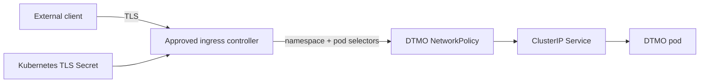

# DTMO Security Overview

Last updated: **2026-08-18**  
Software baseline: **16.0.0rc12 plus accepted post-RC13/E8/Phase-11 repository enhancements**

## Security objectives

DTMO protects confidentiality, integrity, availability, provenance, accountability and controlled dissemination of cyber threat intelligence. Security controls keep source trust, identity, authorization, evidence and human decision boundaries explicit and enforceable.

DTMO is **not production authorized**. Phase 10 concluded `NO-GO / BLOCKED — PLATFORM INDUSTRIALISATION REQUIRED`; Phase 11 is `IN PROGRESS / ACTIVE`. Phase 11.1–11.8b are `PASS / REPOSITORY_COMPLETE`. The active bounded gate is **Phase 11.8c ingress/TLS and network segmentation**, `IN PROGRESS / EXACT-HEAD VALIDATION REQUIRED`.

## Identity and access control

- Server-side RBAC remains authoritative.
- Human and service-account authorities remain separated.
- `handoff:case` remains distinct from `approve:share`.
- Connectors, schedulers, Kubernetes service accounts and integrated platforms do not receive human publication/share or case-handoff authority.
- Automatic service-account token mounting is disabled for the DTMO application workload.
- Runtime secrets and TLS private keys are never stored in repository evidence, logs or screenshots.
- Authentication/authorization failures and missing required runtime identity evidence fail closed.

## Separation of duties

DTMO preserves separation of duties across human approval, service execution, runtime administration and evidence acceptance. Publication/share approval, TheHive case-handoff approval, Kubernetes/GitOps deployment authority, ingress/DNS/certificate administration and independent assurance are distinct authorities; possession of a service credential, workload identity or deployment permission does not confer any other authority. Service identities execute only their bounded technical functions, while accountable human decisions remain attributable and independently reviewable.

## Accepted service and licensing boundaries

Taranis AI, IntelOwl, Cortex, OpenCTI, MISP and TheHive remain separate service/API/identity boundaries under their applicable licensing/provider terms. Kubernetes placement does not merge those products into DTMO and does not transfer license rights, source-code ownership or human authority.

PostgreSQL remains canonical DTMO application/RBAC/intelligence truth. External services contribute bounded collection, enrichment, graph, exchange or case-workflow evidence only. None independently proves DTMO-local exposure, exploitability or compromise.

## Threat and vulnerability management

Threat and vulnerability management remains evidence-led and provenance-bound. DTMO preserves the accepted governance mapping for vulnerability and threat-management controls while Phase 11 changes only the platform runtime and integration architecture. Vulnerability intelligence, dependency/container findings and external-service analyzer output are inputs to governed assessment; they do not independently prove local exploitability, compromise or remediation completion.

The Phase 11.8 runtime foundation strengthens this boundary by requiring immutable image identity and by keeping later supply-chain controls explicit rather than inferred. SBOM generation, vulnerability-policy enforcement, image signing, provenance attestation and admission verification remain separate Phase 11.8 acceptance work. Any future finding must retain source provenance, affected asset or image identity, assessment state and human remediation/acceptance authority. Missing or ambiguous provenance fails closed.

## Accepted Phase 11.8a–11.8b runtime security boundaries

Accepted repository controls include:

- Helm/GitOps desired state is repository-controlled;
- container images require an immutable digest;
- pods run non-root with a read-only root filesystem and dropped Linux capabilities;
- automatic service-account token automounting is disabled;
- readiness/liveness probes and resource requests/limits are explicit;
- a PodDisruptionBudget protects the stateless application workload from avoidable voluntary disruption;
- NetworkPolicy is fail-closed/default-deny;
- external egress is unavailable unless explicitly allowlisted by CIDR;
- provider-neutral workload identity is attached only through deployment-owned ServiceAccount annotations;
- ExternalSecret delivery is opt-in, explicit and keeps secret values out of Git.

Repository acceptance of these controls does not prove live Kubernetes admission, cloud IAM, provider ACLs, secret rotation/revocation, HA or production readiness.

## Phase 11.8c ingress/TLS and network security boundary

The active 11.8c slice adds a governed north-south entry boundary:

- ingress remains disabled by default;
- enabling ingress requires an explicit ingress class and hostname;
- TLS is mandatory when ingress is enabled;
- only a Kubernetes TLS Secret reference is stored declaratively; private key material remains deployment-controlled;
- the DTMO Service remains `ClusterIP`;
- NetworkPolicy must remain enabled when ingress is enabled;
- the ingress-controller peer must match both an explicit namespace selector and an explicit pod selector;
- broad same-namespace ingress is not the accepted north-south path.

Network reachability does not grant human publication/share authority, case-handoff authority, responder authority or proof of local compromise.

## Trust and authority invariants

- Technical deployment success is not dissemination authority.
- Taranis publisher state, IntelOwl/Cortex analyzer results, OpenCTI graph content, MISP state and TheHive case state do **not** authorize DTMO external sharing or publication.
- TheHive case-handoff approval remains a separate human authority.
- Kubernetes workload/service identities and ingress reachability cannot authorize human actions.
- Source handling restrictions and provenance cannot be broadened by runtime configuration.
- Missing, conflicting or unrepresentable evidence fails closed.

## Secrets and configuration

Phase 11.8b establishes provider-neutral workload identity and opt-in external secret delivery. Security requirements remain:

- no raw secret values or TLS private keys in Git, Helm values, documentation evidence or screenshots;
- secret object names/keys may be declarative, but secret material remains deployment-controlled;
- external secret delivery requires explicit store, target and remote-key mappings;
- production credential provenance, rotation, provider permissions and revocation must be proven in deployment-bound evidence.

## Network security

The accepted baseline uses default-deny/fail-closed NetworkPolicy. Phase 11.8c narrows north-south ingress to the approved ingress-controller namespace and pod identity and requires TLS-only ingress when exposure is enabled. Explicit internal dependency and external service flows remain governed; external CIDR egress cannot be implicit.

This repository contract cannot prove that a target CNI enforces NetworkPolicy correctly or that a live ingress controller, DNS provider, certificate process, load balancer or WAF behaves as configured. Those require deployment-bound evidence.

## Availability and recovery boundary

A PodDisruptionBudget improves the stateless application workload's voluntary-disruption posture but does not establish system HA. The accepted runtime slices do not yet prove:

- multi-zone placement or anti-affinity;
- PostgreSQL/Redis/OpenSearch/object-store HA;
- queue/storage durability under node or zone failure;
- backup/restore objectives or exercised recovery;
- capacity, failover or upgrade/rollback behavior.

Those controls remain separate bounded Phase 11.8 work.

## Supply-chain boundary

Phase 11.8 requires immutable image identity by digest. It does **not** yet claim completed SBOM generation, vulnerability-policy enforcement, image signing, provenance attestation or admission verification. Those are explicit later 11.8 supply-chain gates.

No Taranis, IntelOwl, Cortex, OpenCTI, MISP or TheHive upstream source is vendored by these runtime slices. Existing service-to-service licensing boundaries remain unchanged.

## Data protection and privacy

Technical reachability does not establish lawful authority to send intelligence to an external service. Approved source handling, TLP/data-classification rules and provider terms remain authoritative. Credentials, raw source bodies, private notes and unrelated personal data must not be introduced into runtime evidence.

## Evidence boundary

The Phase 11.8c repository gate can establish chart/policy/configuration/documentation contracts only. It cannot establish live DNS ownership, certificate validity, ingress-controller admission, cloud load-balancer/WAF behavior, CNI enforcement, HA/recovery, observability, supply-chain attestation, production-equivalent validation, independent assurance or production authorization.

Historical Phase 8 `PASS / OWNER_ACCEPTED` and Phase 9 `PASS / EXTERNAL_ASSURANCE_ACCEPTED` evidence remains candidate-bound. Fresh Phase 11.10 and Phase 11.11 evidence is required for the integrated candidate before Phase 12.
