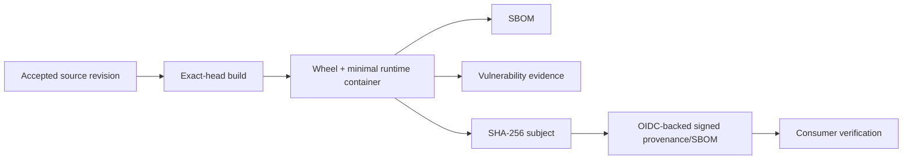

# DTMO Security Overview

Last updated: **2026-08-18**  
Software baseline: **16.0.0rc12 plus accepted post-RC13/E8/Phase-11 repository enhancements**

## Security objectives

DTMO protects confidentiality, integrity, availability, provenance, accountability and controlled dissemination of cyber threat intelligence. Security controls keep source trust, identity, authorization, evidence and human decision boundaries explicit and enforceable.

DTMO is **not production authorized**. Phase 10 remains `NO-GO / BLOCKED — PLATFORM INDUSTRIALISATION REQUIRED`; Phase 11 is `IN PROGRESS / ACTIVE`. Phase 11.1–11.8f are `PASS / REPOSITORY_COMPLETE`. The active bounded gate is **Phase 11.8g software supply-chain hardening**, `IN PROGRESS / EXACT-HEAD VALIDATION REQUIRED`.

## Identity and access control

- Server-side RBAC remains authoritative.
- Human and service identities remain separate.
- `handoff:case` remains distinct from `approve:share`.
- Connectors, CI identities, Kubernetes service accounts and integrated platforms do not receive human publication/share or case-handoff authority.
- Taranis AI, IntelOwl, Cortex, OpenCTI, MISP and TheHive remain separate service/API/licensing/provider boundaries.
- External analyzer, graph, exchange, case, build or signing state does not itself prove DTMO-local exposure, exploitability or compromise.
- Missing, conflicting or unverifiable mandatory evidence fails closed.

## Separation of duties

Human publication/share approval, case handoff, service execution, CI build identity and release signing remain distinct authority domains. A connector, analyzer, Kubernetes workload, CI job or signed artifact cannot self-grant analyst approval or production authority. Release attestations establish artifact provenance only; accountable production authorization remains a later Phase 12 decision after fresh Phase 11.10 validation and Phase 11.11 independent assurance for the same immutable candidate.

## Accepted Phase 11.8 security baseline

Phase 11.8a–11.8f accepted repository controls cover immutable runtime image identity, non-root/read-only workloads, disabled service-account token automounting, external secret delivery boundaries, TLS ingress and network segmentation, application HA/disruption controls, opt-in observability and explicit recovery-domain requirements. These are repository engineering controls and do not prove provider enforcement, live availability, successful recovery or production readiness.

## Active Phase 11.8g software supply-chain boundary

The active slice adds a governed software-artifact evidence chain:

- exact PR-head checkout and build identity;
- Python and container CycloneDX SBOM generation;
- Python dependency and container known-vulnerability evidence;
- fail-closed container `HIGH`/`CRITICAL` vulnerability policy;
- minimal runtime package surface with build-only Python tooling removed after dependency installation;
- SHA-256 artifact subject identity;
- release provenance and SBOM attestations signed through short-lived OIDC-backed identity;
- consumer verification against expected repository/workflow/release identity;
- no long-lived signing key stored in Git.

An attestation proves a signed relationship between an artifact and its declared build/SBOM evidence. It does **not prove** that the artifact is vulnerability-free, safe for production, admitted by a deployment environment or production-authorized.

## Threat and vulnerability management

Vulnerability findings remain provenance-bound evidence. A green scan does not establish absence of unknown vulnerabilities; a red governed finding cannot be silently suppressed. Any exception must remain accountable, time-bounded and bound to the exact artifact/finding identity. Rebuilding the same source does not establish binary equivalence to an earlier accepted artifact.

## Secrets and signing identities

Raw runtime secrets, TLS private keys and long-lived signing keys do not belong in Git, Helm values, documentation evidence or screenshots. Release signing uses a short-lived workload identity path. Registry or deployment credentials remain deployment-owned secrets and are not introduced into repository supply-chain evidence.

## Availability, recovery and later controls

Accepted HA, observability and recovery repository boundaries remain unchanged. Capacity/resource planning and exercised upgrade/rollback controls remain later bounded Phase 11.8 work. Phase 11.10 and 11.11 must still provide fresh production-equivalent validation and independent assurance for the immutable integrated candidate before Phase 12.

## Data protection and privacy

Artifact metadata, SBOMs and vulnerability evidence must avoid credentials, raw intelligence payloads, private notes and unnecessary personal data. Technical artifact verification does not establish legal authority to collect, enrich, synchronize, publish or redistribute intelligence.

## Evidence boundary

The Phase 11.8g repository gate can prove exact-head build, SBOM, vulnerability, hash, workflow and documentation contracts only. It cannot prove that a future release attestation exists until the release workflow runs, registry integrity, deployment verification/admission, runtime integrity, production-equivalent validation, independent assurance or production authorization.

Historical Phase 8 `PASS / OWNER_ACCEPTED` and Phase 9 `PASS / EXTERNAL_ASSURANCE_ACCEPTED` evidence remains candidate-bound and is not reused for the materially changed Phase 11 platform.
