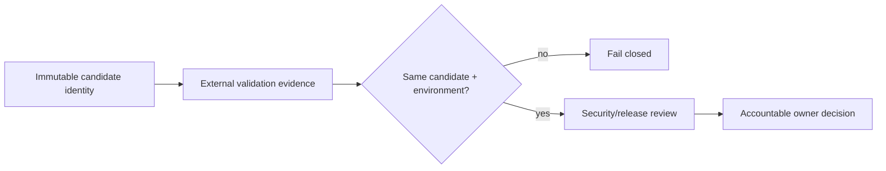

# DTMO Security Overview

Last updated: **2026-08-20**  
Software baseline: **16.0.0rc12 plus accepted post-RC13/E8/Phase-11 repository enhancements**

## Security objectives

DTMO protects confidentiality, integrity, availability, provenance, accountability and controlled dissemination of cyber threat intelligence. Security controls keep source trust, identity, authorization, evidence and human decision boundaries explicit and enforceable.

DTMO is **not production authorized**. Phase 10 remains `NO-GO / BLOCKED — PLATFORM INDUSTRIALISATION REQUIRED`; Phase 11 is `IN PROGRESS / ACTIVE`. Phase 11.1–11.9 and Phase 11.10a are `PASS / REPOSITORY_COMPLETE`. Phase 11.10 remains `IN PROGRESS / FRESH CANDIDATE-BOUND EVIDENCE REQUIRED`; its active bounded implementation gate is **Phase 11.10b canonical application shell**, `IN PROGRESS / EXACT-HEAD VALIDATION REQUIRED`. Phase 11.10c, Phase 11.11 and Phase 12 are `NOT STARTED`.

## Identity and access control

- **Server-side RBAC remains authoritative.**
- Human and service identities remain separate.
- `handoff:case` remains distinct from `approve:share`.
- Connectors, CI identities, Kubernetes service accounts, frontend controls and integrated platforms do not receive human publication/share or case-handoff authority.
- Taranis AI, IntelOwl, Cortex, OpenCTI, MISP and TheHive remain separate service/API/licensing/provider boundaries.
- External analyzer, graph, exchange, case, build, deployment or evidence state does not itself prove DTMO-local exposure, exploitability or compromise.
- Missing, conflicting or unverifiable mandatory evidence fails closed.

## Separation of duties

Human publication/share approval, case handoff, service execution, CI build identity, deployment, validation review, release signing and production authorization remain distinct authority domains. A connector, analyzer, Kubernetes workload, browser control, CI job, signed artifact or evidence validator cannot self-grant analyst approval or production authority.

Phase 11.10p will require attributable deployment operator, validation operator, security/release reviewer and accountable-owner roles. Organizational policy determines whether individuals may hold more than one role, but evidence must preserve actor/reviewer attribution and accountable acceptance.

## Accepted Phase 11.8–11.10a security baseline

Phase 11.8 accepted repository controls cover immutable runtime image identity, non-root/read-only workloads, disabled service-account token automounting, workload identity, external secret delivery, ingress/TLS and network segmentation, application HA/disruption controls, opt-in observability, recovery requirements, software supply-chain hardening, capacity/resource planning and upgrade/rollback contracts.

The supply-chain baseline includes Python and container CycloneDX SBOM generation, known-vulnerability evidence, a **minimal runtime** package surface, SHA-256 artifact identity, OIDC-backed signed provenance/SBOM mechanisms and no repository-stored long-lived signing key. An attestation proves a signed relationship between an artifact and declared evidence; it does **not prove** vulnerability absence, deployment admission or production readiness.

Phase 11.9 accepted the forward-first migration/application compatibility contract. Rolling overlap requires backward-compatible schema behavior; destructive changes require expand/migrate/contract; application rollback never implies automatic database down migration.

Phase 11.10a accepted the frontend architecture security boundary: normal browser operations use **browser → DTMO API → governed integration adapter → upstream service**. Role-aware presentation is not authorization, upstream service credentials do not become normal browser credentials, human publication/share authority remains separate from case authority, and enrichment/graph/correlation state does not prove local compromise.

These are repository engineering controls and do not prove provider enforcement, live availability, successful recovery, production-equivalent behavior or production authorization.

## Active Phase 11.10b canonical-shell security boundary

The canonical shell is separately built with React/TypeScript/Vite and served through the DTMO application origin under `/workbench/`. `/ui/console` is retained only as a migration **compatibility path** while bounded feature migration proceeds.

Security requirements for the active shell include:

- direct frontend dependencies exact-pinned and the npm dependency graph committed in a lockfile;
- supported CI/container builds consume that graph with `npm ci` rather than regenerate resolution;
- Node/npm remain build-stage tooling and only built static assets enter the Python runtime image;
- canonical index uses a strict self-origin Content Security Policy with inline script/style execution not required;
- hashed frontend assets use immutable caching while the index remains non-cacheable;
- static asset path handling fails closed on traversal outside the build asset root;
- shell server state is same-origin and cannot introduce a privileged direct browser-to-upstream path;
- browser-local persistence is limited to non-sensitive presentation preference in this slice;
- no upstream secret, token, private key or approval authority is stored as ordinary frontend state;
- the command palette is navigation-only and cannot execute governed high-impact actions;
- context rail starts with explicit no-selection truth and cannot infer facts because a service is configured;
- placeholder routes do not fabricate intelligence, cases, vulnerabilities, connector status or approval state;
- server-side RBAC, audit/provenance, human publication/share authority and separate TheHive case authority remain authoritative.

The dedicated application-shell gate may establish dependency/build integrity, same-origin serving, routing, CSP/cache behavior and bounded browser mechanics. It **does not prove** live upstream integration behavior, Command Center feature acceptance, production-equivalent operation, independent assurance or production authorization.

## Phase 11.10p production-equivalent security boundary

After 11.10a–11.10o candidate completion and immutable candidate freeze, the production-equivalent exercise must bind all evidence to one immutable integrated candidate and one approved environment. Required evidence classes are immutable candidate identity, migration/compatibility, upgrade, rollback, health/readiness, saturation/capacity and recovery/continuity.

Security requirements include:

- application and prior application identities recorded by immutable `sha256:` digest;
- workload identity/external secret controls remain effective during upgrade/recovery/rollback;
- TLS/network boundaries remain controlled during the exercise;
- no raw secrets, bearer tokens, private keys or unnecessary personal data are committed as evidence;
- evidence references may use approved restricted storage;
- every evidence item carries the same candidate fingerprint;
- rollback restores the exact prior immutable application digest and includes post-rollback health;
- database down migration is not automatically invoked by application rollback;
- degraded or recovered states do not fabricate intelligence or broaden authority;
- release-blocking findings remain blockers until closed or accountably dispositioned.

## Threat and vulnerability management

Vulnerability findings remain provenance-bound evidence. A green scan does not establish absence of unknown vulnerabilities; a governed finding cannot be silently suppressed. Any exception must remain accountable, time-bounded and bound to the exact artifact/finding identity. Rebuilding the same source does not establish binary equivalence to an earlier accepted artifact.

Phase 11.10b adds a frontend production-dependency audit while existing container/package SBOM and vulnerability controls remain regression gates. Neither frontend nor container scan results establish vulnerability absence or production authorization.

## Secrets and signing identities

Raw runtime secrets, TLS private keys and long-lived signing keys do not belong in Git, Helm values, frontend storage, documentation evidence or screenshots. Release signing uses a short-lived workload identity path. Registry/deployment credentials remain deployment-owned secrets and are not introduced into repository evidence.

## Availability, capacity and recovery

Phase 11.8 HA, observability, capacity and recovery repository boundaries are accepted. Phase 11.10p must later provide real production-equivalent observations of health/readiness, representative saturation behavior and recovery/continuity for the integrated candidate. Recovery evidence records integrity outcomes and observed RPO/RTO where applicable.

## Data protection and privacy

Artifact metadata, SBOMs, vulnerability evidence and Phase 11.10 manifests must avoid credentials, raw intelligence payloads, private notes and unnecessary personal data. Technical connectivity or evidence validation does not establish legal authority to collect, enrich, synchronize, publish or redistribute intelligence.

## Evidence boundary

Repository CI can prove repository-controlled contracts and exact-head outputs only. It cannot prove live Kubernetes behavior, real production-equivalent migration, upgrade, rollback, saturation, recovery, independent assurance or production authorization. The Phase 11.10 manifest validator checks metadata consistency; it cannot independently prove the truth of referenced external evidence.

Historical Phase 8 `PASS / OWNER_ACCEPTED` and Phase 9 `PASS / EXTERNAL_ASSURANCE_ACCEPTED` evidence remains candidate-bound and is not reused for the materially changed Phase 11 platform. Phase 11.11 independent external assurance remains `NOT STARTED` until Phase 11.10 is explicitly accepted.
