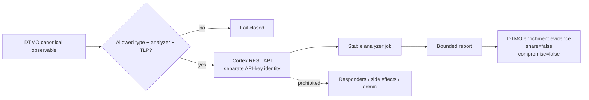

# DTMO Security Overview

Last updated: **2026-08-17**  
Software baseline: **16.0.0rc12 plus accepted post-RC13/E8/Phase-11 repository enhancements**

## Security objectives

DTMO protects confidentiality, integrity, availability, provenance, accountability and controlled dissemination of cyber threat intelligence. Security controls keep source trust, identity, authorization, evidence and human decision boundaries explicit and enforceable.

DTMO is **not production authorized**. Phase 10 concluded `NO-GO / BLOCKED — PLATFORM INDUSTRIALISATION REQUIRED`; Phase 11 is `IN PROGRESS / ACTIVE`. Phase 11.1–11.6 are `PASS / REPOSITORY_COMPLETE`. The accepted Phase 11.7 no-Cortex decision remains a historical baseline; the active bounded gate is **Phase 11.7b owner-required Cortex analyzer connector**.

## Identity and access control

- Server-side RBAC is authoritative.
- Human and service-account authorities remain separated.
- Least privilege and explicit role/permission scope are enforced server-side.
- `handoff:case` is a dedicated human permission and remains separate from `approve:share`.
- Service accounts, connectors, schedulers and integrated platforms do not receive human review/share-approval or case-handoff authority.
- Cortex uses a dedicated API-key service identity with only the approved organization/analyze/read-job capability needed by the connector.
- Runtime secrets are never stored in repository evidence, logs or screenshots.
- Authentication/authorization failures fail closed and never trigger privilege broadening.

## Separation of duties and publication authority

Technical success is not dissemination or incident-escalation authority. Taranis publisher state, IntelOwl/Cortex analyzer results, OpenCTI graph content, MISP ingest/delivery success and TheHive case state do **not** authorize DTMO external sharing or publication. Human review and governed DTMO share approval remain authoritative. TheHive case-handoff approval is a separate human authority.

## Threat and vulnerability management

DTMO threat and vulnerability management keeps CTI, enrichment, vulnerability context and local security conclusions separate and provenance-backed. Taranis, IntelOwl, Cortex, OpenCTI and MISP may contribute source, enrichment, graph or exchange context, but none of those external service results independently proves DTMO-local exposure, exploitability, compromise or attribution certainty. Vulnerability prioritization and governance mappings therefore remain explicit, reviewable and bounded to the evidence available to DTMO.

Phase 11 integration changes preserve this governance boundary: service-to-service processing cannot grant publication/share authority, case-handoff authority or local-compromise status. Missing, conflicting or unrepresentable security evidence fails closed rather than being inferred.

## Accepted Phase 11 service boundaries

Phase 11.3 IntelOwl remains a separate AGPL-3.0 service/API boundary. Phase 11.4 OpenCTI remains a separate service/API boundary with Community Apache-2.0 and separately licensed Enterprise features. Phase 11.5 MISP remains a separate AGPL-3.0 service/API boundary with authoritative distribution/sharing-group/TLP restrictions and human-approved unpublished export. Phase 11.6 keeps TheHive as a separate StrangeBee service/API boundary with deployment-specific license entitlement.

The Phase 11.7b Cortex integration adds another separate service/API identity boundary. StrangeBee documents Cortex itself as fully open source and not requiring a Cortex product license. Individual analyzers and the third-party services they call can carry independent licenses, subscriptions and disclosure terms; every enabled analyzer must therefore remain explicitly allowlisted and separately approved.

None of these services independently establishes DTMO-local exploitability, exposure or compromise.

## Phase 11.7b Cortex security boundary

Only analyzer execution is in scope. DTMO uses `POST /api/analyzer/{ANALYZER_ID}/run` for one explicitly approved non-file observable and `GET /api/job/{JOB_ID}/waitreport` to retrieve a bounded report. API-key bearer authentication is required. The feature is disabled by default and production configuration requires HTTPS, a runtime API token and a non-empty analyzer allowlist.

Security invariants:

- analyzer IDs and observable datatypes are explicit allowlists;
- personal-data datatypes are excluded from the bounded baseline;
- explicit TLP values must be in the Cortex 0..3 range and upstream handling may not be broadened;
- stable Cortex job identity is mandatory;
- returned analyzer identity must match the requested analyzer when present;
- malformed or oversized reports fail closed;
- report metadata is forced to `external_share_authorized=false` and `local_compromise_proven=false`;
- Cortex output is enrichment evidence only and never becomes canonical compromise proof;
- responders, external side-effect actions, organization/user administration, analyzer enable/disable/update and job deletion remain excluded;
- file/attachment analysis and raw-body transfer are excluded from this slice;
- automatic fallback from IntelOwl to Cortex or from Cortex to IntelOwl is prohibited because alternate-provider selection must remain explicit and governed;
- API credentials and provider secrets are not persisted in result payloads or documentation evidence.

## TheHive security boundary

The accepted Phase 11.6 TheHive path remains only explicit human-authorized `POST /api/v1/case` with `handoff:case`, durable mutation reservation/reconciliation, stable identity, no blind replay after ambiguity, minimized payloads and hard no-share/no-local-compromise invariants. Cortex analyzer integration does not inherit or expand TheHive case-handoff authority.

## Data protection and privacy

Technical reachability or API permission does not establish lawful authority to send data to Cortex or any analyzer provider.

- Only approved observable values may cross the boundary.
- Personal-data observable classes remain excluded from Phase 11.7b.
- Analyzer/provider terms and disclosure destination must be reviewed before allowlisting.
- Source handling and TLP restrictions cannot be broadened by connector configuration.
- Credentials, raw source bodies, private notes and unrelated personal data must not be embedded in analyzer messages or result metadata.

## Persistence, auditability and integrity

PostgreSQL remains canonical DTMO application/RBAC/intelligence state. Cortex job state and reports are external enrichment evidence only. The connector binds the DTMO canonical item ID to the returned Cortex job/analyzer identity in normalized metadata and hard-sets no-share/no-local-compromise flags.

This bounded slice does not yet introduce a new Cortex persistence table or automatic replay state. Later persistence or orchestration changes require a separate bounded PR and exact-head acceptance.

## Supply chain and licensing security

- Exact-head CI is required before protected merge; a new commit invalidates earlier exact-head evidence.
- DTMO is Apache-2.0.
- IntelOwl/pyIntelOwl and MISP remain separate AGPL-3.0 services.
- OpenCTI Community Edition is Apache-2.0; Enterprise Edition is separately licensed.
- TheHive is a separate licensed StrangeBee service; deployed entitlement must be verified.
- Cortex remains a separate fully open-source service according to StrangeBee documentation; analyzer code and third-party provider terms require separate review.
- No Cortex or Cortex-Analyzers source is vendored by Phase 11.7b.
- Repository CI is engineering evidence only and does not establish production authorization.

## Evidence boundary

The Phase 11.7b gate can establish synthetic repository evidence for request validation, configuration guardrails, endpoint/authentication behavior, identity validation, bounded report normalization and documentation consistency only. It cannot establish live Cortex connectivity, effective organization permissions, enabled analyzer quality, provider entitlement, lawful disclosure, network controls, HA/recovery, production-equivalent validation, independent assurance or production authorization.

Historical Phase 8/9 evidence remains candidate-bound. Fresh Phase 11.10 and 11.11 evidence is required for the integrated Phase 11 candidate before Phase 12.
