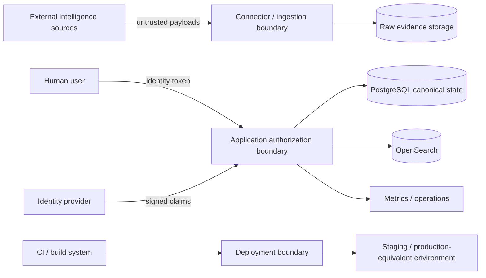

# DTMO Threat Model

## Purpose

This threat model identifies material threat classes, protected assets, trust boundaries and required control objectives for DTMO. It is a living security design document and complements, but does not replace, target-specific penetration testing or other Phase 9 external assurance.

## Protected assets

Primary assets include:

- normalized intelligence and provenance;
- raw source evidence;
- principal, role and authorization state;
- bearer-token trust and identity configuration;
- source/catalog configuration and logical secret references;
- review and external-share decisions;
- audit records and correlation context;
- staging/production deployment identity and configuration;
- operational telemetry and recovery material.

## Threat actors

Relevant actor classes include:

- unauthenticated internet attacker;
- authenticated low-privilege user;
- malicious or compromised privileged user;
- compromised service account or connector;
- malicious or compromised intelligence source;
- supply-chain/dependency attacker;
- attacker with infrastructure or CI access;
- accidental operator or configuration error.

## Principal trust boundaries

## Threat catalogue

| Threat | Example impact | Required control objective |
|---|---|---|
| Source payload manipulation | False or malicious intelligence enters pipeline | Strict parsing, provenance, supported canonical types, raw-evidence retention, fail-closed normalization |
| SSRF / unsafe source endpoint | Connector reaches unauthorized network resources | Endpoint validation, protocol restrictions, network controls, least privilege |
| Credential disclosure | Source or infrastructure credentials exposed | Logical secret references, external secret storage, no raw secrets in repository/evidence |
| Authentication bypass | Unauthorized API/console access | Cryptographic token validation, issuer/audience/key validation, fail-closed identity handling |
| Privilege escalation | Analyst/service identity gains admin/share authority | Server-side RBAC, code-controlled roles, human/service separation, privileged-action checks |
| Administrator lockout or self-escalation | Governance control lost | Self-management restrictions and final-active-admin protection |
| Canonical-state inconsistency | UI/search indicates data committed when DB truth differs | PostgreSQL commit boundary as canonical success criterion |
| Search/index poisoning | Misleading investigation results | Canonical DB authority, controlled indexing, provenance-backed reads |
| Raw evidence tampering | Loss of evidential integrity | Controlled object access, provenance, integrity/audit controls |
| Audit log tampering | Privileged action cannot be reconstructed | Tamper-evident audit design, actor/action/correlation context |
| Token replay / stale privilege | Revoked user retains effective access | Token lifecycle/revocation strategy and external IdP reconciliation |
| Unauthorized publication | Intelligence shared without approval | Explicit human review and separate external-share approval |
| CI/supply-chain compromise | Malicious code or workflow enters release | Exact-head verification, dependency governance, review, immutable release identity |
| Environment drift | Staging evidence does not match target deployment | Immutable deployment identity, configuration parity and image digest evidence |
| Data/privacy overcollection | Excess personal/sensitive data retained | Data minimization, classification and retention controls |
| Availability exhaustion | API, queue, search or storage unavailable | Performance controls, backpressure, alerting, recovery and operational runbooks |

## STRIDE-oriented review

DTMO uses STRIDE as a design-review lens rather than as a claim of exhaustive coverage:

- **Spoofing:** token forgery, service identity impersonation, source identity spoofing;
- **Tampering:** intelligence, mappings, audit state, deployment artifacts;
- **Repudiation:** missing actor/correlation evidence for privileged actions;
- **Information disclosure:** credentials, sensitive intelligence, personal data, operational secrets;
- **Denial of service:** source storms, queue saturation, dependency degradation, resource exhaustion;
- **Elevation of privilege:** role escalation, service-to-human authority crossing, share-approval bypass.

## Security assumptions

The architecture assumes that external identity trust, secret storage, network controls and production-equivalent platform controls are correctly provisioned by the target environment. Local Compose defaults are not production security evidence.

## Validation requirements

Repository tests validate selected security contracts. Phase 8 must validate environment-specific controls against one immutable staging deployment. Phase 9 must independently test relevant attack surfaces and assumptions, with findings formally dispositioned and retested where required.

## Review triggers

Review this threat model after material trust-boundary, identity, connector, storage, administration, publication, deployment or external-assurance changes, and before production go/no-go.
