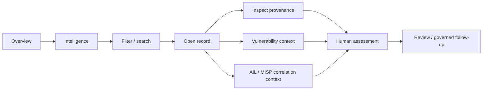
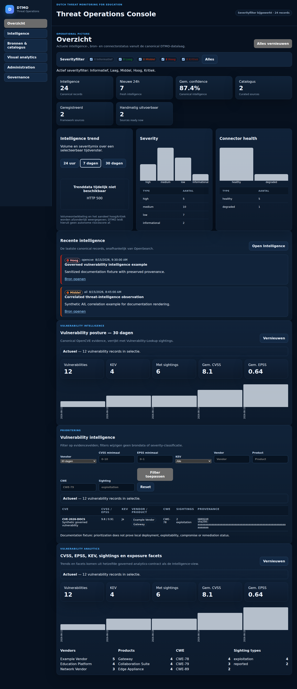
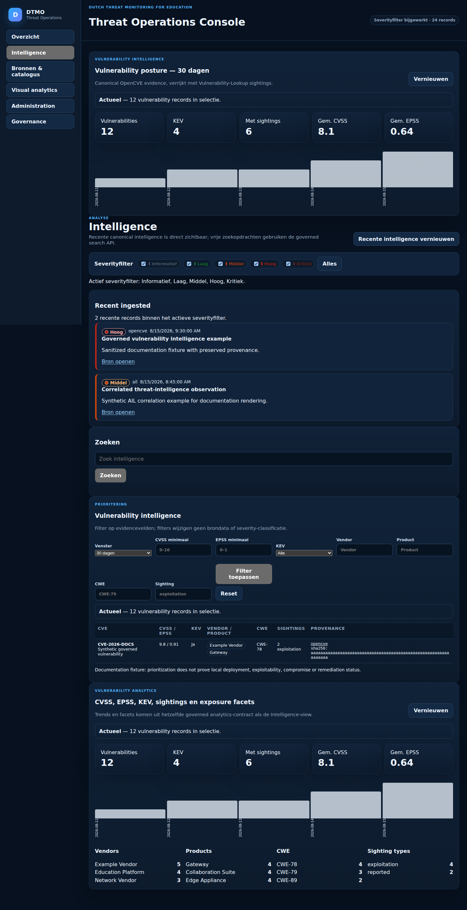
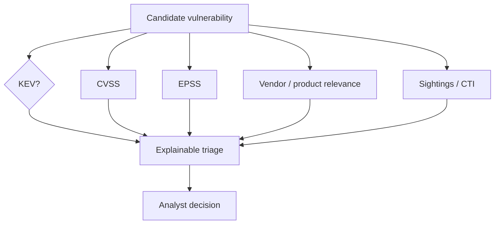
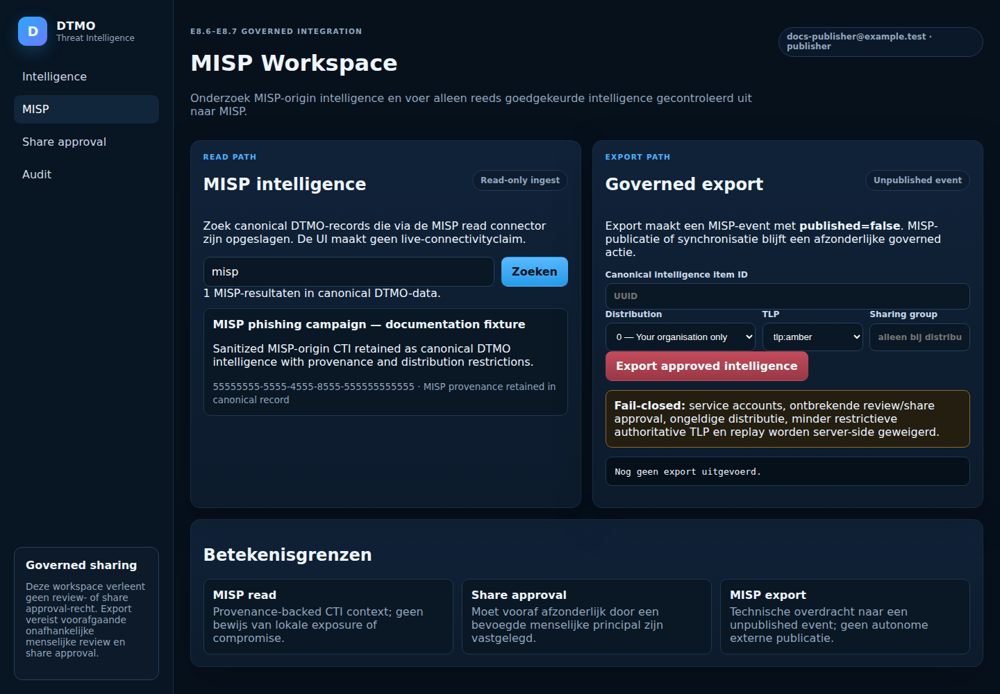
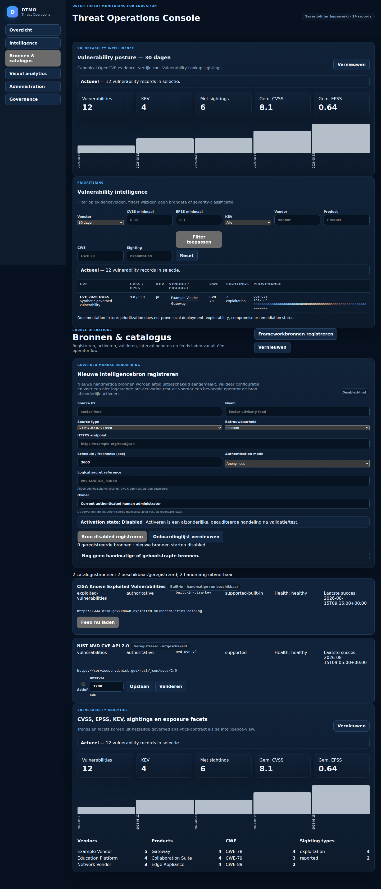
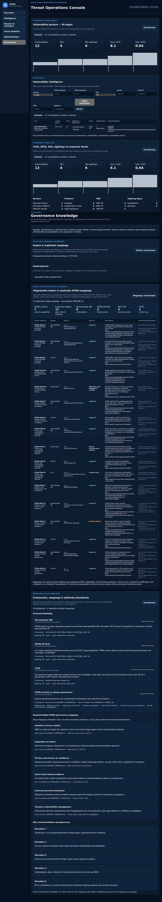
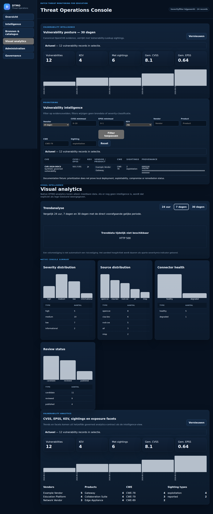

# DTMO User Guide

**Audience:** analysts, reviewers and other permitted human users  
**Scope:** governed use of the DTMO console; this guide does not grant permissions or sharing authority.

## 1. Console navigation

DTMO uses one application shell with the primary surfaces **Overview**, **Intelligence**, **Sources & Catalogue**, **Visual analytics**, **Administration** and **Governance**. What a user can see and perform remains dependent on server-side authorization.

## 2. Analyst journey

### Step 1 — Start at Overview

Use Overview to understand volume, severity mix, confidence, connector health, recent intelligence and vulnerability posture. Dashboard figures are orientation signals; investigate the underlying records before drawing operational conclusions.

*Figure UI-01 — Actual DTMO runtime Overview surface. Synthetic fixture data is used; documentation illustration only.*

### Step 2 — Open Intelligence

The Intelligence view presents recent records and search/filter functions. Severity filters are evidence-view filters; changing a filter does not change the source classification of the underlying record.

*Figure UI-02 — Actual DTMO runtime Intelligence surface. Synthetic fixture data is used; documentation illustration only.*

### Step 3 — Search and inspect a record

Use search to locate relevant records by permitted fields. When a record is opened, inspect source identity, canonical URL, timestamps, confidence, provenance and available enrichment before relying on the derived summary.

### Step 4 — Evaluate vulnerability context

For vulnerability records, consider CVSS, EPSS, KEV status, vendor/product relevance and sightings together. No individual signal proves that a vulnerability exists in the local environment.

*Figure UI-04 — Vulnerability prioritization and analytics in the actual DTMO runtime UI; not proof of local exploitability or exposure.*

### Step 5 — Use AIL correlation carefully

AIL correlation may show exact indicator relationships to MISP events, vulnerabilities or investigation references. The correlation is analytical context only. It must not be interpreted as proof of exposure, compromise, attribution or external-share authority.

*Figure UI-06 — Actual DTMO runtime investigation surface captured by the Documentation Screenshot Artifact Gate. Synthetic fixture data is used; the image is documentation illustration only and is not staging, assurance or production evidence.*

Relevant workflow: **WF-04** in [`SYSTEM_WORKFLOWS.md`](../architecture/SYSTEM_WORKFLOWS.md).

### Step 6 — Use MISP under governed sharing rules

MISP read data may enrich an investigation. Outbound MISP export is a separate governed action and requires the configured authorization and human approval path. Never infer approval merely because an export function exists.

*Figure UI-05 — Actual DTMO MISP workspace with synthetic fixture data. The image demonstrates the read and governed-export interaction surface only; no outbound export was executed and live MISP connectivity is not proven.*

Relevant workflow: **WF-03**.

## 3. Sources & Catalogue

The source catalogue explains which sources are defined and which execution profiles are supported. Runtime source status indicates registration/health information. A source shown as supported or registered is not evidence that the current staging or production environment successfully reached it. Likewise, a fixture-backed or repository-generated view does not prove live source connectivity.

*Figure UI-03 — Actual DTMO runtime source/catalogue surface. A displayed source does not prove current external connectivity.*

## 4. Severity and classification

DTMO uses the product severity classes **Informational, Low, Medium, High and Critical** where applicable. Severity is not the same as confidence, relevance or review status. Analysts should keep those dimensions separate when interpreting a record.

## 5. Governance view

Use Governance to understand controlled relationships between DTMO evidence and frameworks such as Normenkader IBP, MITRE ATT&CK and NIST CSF. Framework mappings explain evidence relationships; they do not automatically establish compliance, maturity or certification.

*Figure UI-08 — Actual DTMO Governance surface. Framework relationships are contextual mappings, not blanket compliance claims.*

## 6. Visual Analytics

Visual Analytics provides trends and aggregated operational views. When Grafana is used, its separate authentication and datasource controls remain in force. A chart should be traceable back to governed DTMO data rather than treated as an independent evidence source.

*Figure UI-07 — Actual DTMO runtime analytics surface with sanitized fixture data.*

## 7. Failure and degraded states

When a source, dependency or search component is degraded:

- do not treat missing results as proof that no threat exists;
- preserve visible degraded-state information;
- prefer attributable existing evidence over fabricated or inferred data;
- report unexpected behavior through the operational process;
- do not bypass security controls to restore convenience.

## 8. What screenshots prove

Screenshots in this guide show the real DTMO runtime UI rendered with sanitized synthetic fixture data unless explicitly labelled otherwise. They demonstrate layout and interaction surfaces only. They do not prove live source connectivity, production-equivalent deployment behavior, penetration-test acceptance or production readiness.

## 9. Related documentation

- [`PRODUCT_GUIDE.md`](../product/PRODUCT_GUIDE.md)
- [`ADMINISTRATOR_GUIDE.md`](../administration/ADMINISTRATOR_GUIDE.md)
- [`SYSTEM_WORKFLOWS.md`](../architecture/SYSTEM_WORKFLOWS.md)
- [`EVIDENCE_INDEX.md`](../evidence/EVIDENCE_INDEX.md)
