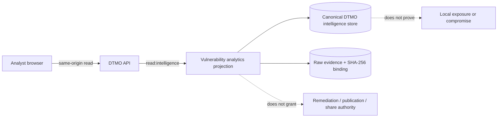

# Vulnerability & Exposure Workspace

Status: **Phase 11.10i — IN PROGRESS / EXACT-HEAD VALIDATION REQUIRED**

The canonical **Vulnerability & Exposure Center** is available at `/workbench/exposure`. It is a read-only analyst workspace over DTMO's existing canonical vulnerability analytics projection. The browser calls DTMO-owned same-origin APIs only; it never receives upstream service credentials and it does not become a vulnerability scanner, remediation console or privileged integration client.

## Purpose

Use this workspace to review attributable vulnerability intelligence and prioritization evidence from the canonical DTMO store. The current bounded view covers the 30-day vulnerability analytics projection and presents CVSS, EPSS and CISA KEV evidence where those values are actually present in the canonical record.

CVSS, EPSS and KEV support prioritization. They are **not** evidence that a local asset is exposed, exploitable, compromised, remediated or safe. The presence of a CVE in intelligence does not prove local exposure, and absence of a record does not prove absence of exposure.

## Access and authority

Reading the workspace remains governed by server-side `read:intelligence` authorization. Role-aware frontend presentation is usability only; **server-side RBAC** is authoritative.

This Phase 11.10i slice is read-only. It grants no remediation authority, scanner execution authority, case-handoff authority, publication authority or external-share authority. Existing human review, sharing approval and TheHive case-handoff controls remain separate governed actions.

## Using the workspace

Open **Exposure** from the Unified Operations Workbench navigation. The view loads `GET /api/v1/console/vulnerability-analytics?window=30d` through the same-origin DTMO API boundary.

The list can be filtered to:

- **All** — all attributable vulnerability evidence returned by the canonical projection;
- **KEV** — records with CISA KEV evidence present;
- **CVSS ≥ 9** — records whose attributable CVSS score is at least 9.0.

Each row may show the CVE or canonical title, source identity, CVSS score, EPSS value, KEV indication, vendor/product mapping and raw-evidence binding where available. Missing values remain visibly missing; they are never synthesized.

## Fail-closed behavior

The workspace must **fail closed** when evidence cannot be established. If the canonical API is unavailable, the UI reports vulnerability evidence as unavailable rather than presenting a synthetic zero-risk state. If the API reports degraded evidence reasons, those reasons remain visible. Missing raw-evidence references, malformed records or unavailable attributes are not silently promoted to trusted facts.

A configured connector or repository integration does not prove live upstream health. Repository CI and browser tests validate repository-controlled contracts only and do not prove a live vulnerability provider, production-equivalent operation, local exposure, compromise or remediation.

## Provenance and evidence interpretation

Treat vulnerability fields as intelligence evidence tied to their canonical DTMO source and provenance chain. Preserve source attribution when using the information in analysis, investigation, case or sharing workflows.

The accepted architecture remains:

## Operational boundaries

Do not interpret any of the following as production or security proof:

- a green repository workflow;
- a configured vulnerability connector;
- CVSS, EPSS or KEV presence;
- a canonical vulnerability record;
- an empty result set;
- a successful frontend build.

Phase 10 remains **NO-GO / BLOCKED — PLATFORM INDUSTRIALISATION REQUIRED**. DTMO is **not production authorized**. Fresh production-equivalent validation remains a later candidate-bound Phase 11.10p activity after Phase 11.10a–o candidate completion and immutable candidate freeze. Historical Phase 8/9 evidence remains prior-candidate history and cannot be reused for the materially changed integrated candidate.

## Related authoritative documentation

- `docs/architecture/PHASE11_10I_VULNERABILITY_EXPOSURE.md`
- `docs/qa/PHASE11_10I_VULNERABILITY_EXPOSURE_GATE.md`
- `docs/security/SECURITY_OVERVIEW.md`
- `docs/project/CURRENT_STATE.md`
- `docs/roadmap/PLATFORM_INDUSTRIALISATION_ROADMAP.md`
- `.github/workflows/phase11-vulnerability-exposure.yml`

The next bounded roadmap step may start only after Phase 11.10i has a fully green final exact head, synchronized documentation, ready-for-review state and protected merge.