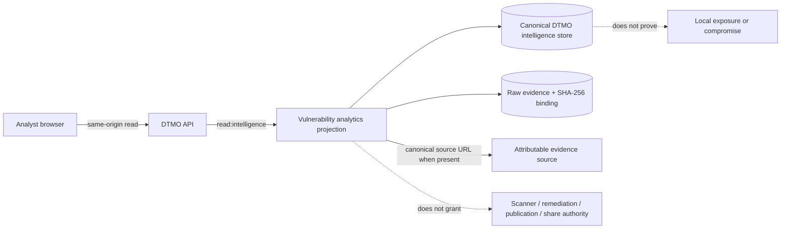

# Vulnerability & Exposure Workspace

Status: **Phase 11.10q — FUNCTIONAL RECOVERY / EXACT-HEAD VALIDATION REQUIRED**

The canonical **Vulnerability & Exposure Center** is available at `/workbench/exposure`. It is a read-only analyst workspace over DTMO's existing canonical vulnerability analytics projection. The browser calls DTMO-owned same-origin APIs only; it never receives upstream service credentials and it does not become a vulnerability scanner, remediation console or privileged integration client.

## Purpose

Use this workspace to review attributable vulnerability intelligence and prioritization evidence from the canonical DTMO store. The current bounded view covers the 30-day vulnerability analytics projection and presents CVSS, EPSS, CISA KEV, vendor, product and CWE evidence where those values are actually present in the canonical record.

CVSS, EPSS and KEV support prioritization. They are **not** evidence that a local asset is exposed, exploitable, compromised, remediated or safe. The presence of a CVE in intelligence does not prove local exposure, and absence of a record does not prove absence of exposure.

## Access and authority

Reading the workspace remains governed by server-side `read:intelligence` authorization. Role-aware frontend presentation is usability only; **server-side RBAC** is authoritative.

This recovery slice is read-only. It grants no remediation authority, scanner execution authority, case-handoff authority, publication authority or external-share authority. Existing human review, sharing approval and TheHive case-handoff controls remain separate governed actions.

## Using the workspace

Open **Exposure** from the Unified Operations Workbench navigation. The view loads `GET /api/v1/console/vulnerability-analytics?window=30d` through the same-origin DTMO API boundary.

The canonical vulnerability inventory can be filtered by:

- **Priority view** — all records, CISA KEV evidence, or CVSS ≥ 9;
- **Vendor** — case-insensitive matching against attributable vendor values;
- **Product** — case-insensitive matching against attributable product values;
- **CWE** — case-insensitive matching against attributable CWE values;
- **Minimum EPSS (%)** — only records whose recorded EPSS meets the selected threshold.

Missing attributes never satisfy a positive filter and are never synthesized. An empty filtered view therefore describes only the current canonical projection and selected filters; it is not evidence that upstream vulnerabilities or local exposure are absent.

Each row may show the CVE or canonical title, source identity, CVSS score, EPSS value, KEV indication, vendor/product/CWE mapping, discovery timestamp and raw-evidence binding where available. Missing values remain visibly missing.

Where the canonical record contains a source URL, **Open evidence source** provides an object-specific provenance pivot to that attributable source. This pivot is evidence navigation only. It does not grant scanner, remediation, investigation, case, publication or external-sharing authority and it does not imply that a local asset is affected.

## Governed population path

The workspace does not fabricate sample vulnerabilities to make the screen appear populated. Its inventory reflects records already present in the canonical DTMO vulnerability analytics projection. If there is no canonical vulnerability evidence, an authorized operator should use **Sources & Collection** to run an enabled governed vulnerability source. Connector configuration or a successful repository test is not proof that a live provider is healthy or that ingestion has occurred in a production-equivalent environment.

## Fail-closed behavior

The workspace must **fail closed** when evidence cannot be established. If the canonical API is unavailable, the UI reports vulnerability evidence as unavailable rather than presenting a synthetic zero-risk state. If the API reports degraded evidence reasons, those reasons remain visible. Missing raw-evidence references, malformed records or unavailable attributes are not silently promoted to trusted facts.

A configured connector or repository integration does not prove live upstream health. Repository CI and browser tests validate repository-controlled contracts only and do not prove a live vulnerability provider, production-equivalent operation, local exposure, compromise or remediation.

## Provenance and evidence interpretation

Treat vulnerability fields as intelligence evidence tied to their canonical DTMO source and provenance chain. Preserve source attribution when using the information in analysis, investigation, case or sharing workflows.

The accepted architecture remains:

## Recovery acceptance boundary

This slice materially closes the repository-controlled **Exposure population/filtering** gap by making the canonical vulnerability inventory usable without synthetic data and by providing CVSS/EPSS/KEV/vendor/product/CWE filtering plus provenance pivots. It does **not** by itself change Phase 11.10q to PASS. The owner functional retest remains authoritative, and the remaining recovery blockers must still be resolved in sequence.

## Operational boundaries

Do not interpret any of the following as production or security proof:

- a green repository workflow;
- a configured vulnerability connector;
- CVSS, EPSS or KEV presence;
- a canonical vulnerability record;
- an empty result set;
- a successful frontend build.

Phase 10 remains **NO-GO / BLOCKED — PLATFORM INDUSTRIALISATION REQUIRED**. DTMO is **not production authorized**. Fresh production-equivalent validation remains a later candidate-bound activity after functional recovery, owner acceptance and immutable candidate freeze. Historical Phase 8/9 evidence remains prior-candidate history and cannot be reused for the materially changed integrated candidate.

## Related authoritative documentation

- `docs/architecture/PHASE11_10I_VULNERABILITY_EXPOSURE.md`
- `docs/qa/PHASE11_10I_VULNERABILITY_EXPOSURE_GATE.md`
- `docs/security/SECURITY_OVERVIEW.md`
- `docs/project/CURRENT_STATE.md`
- `docs/roadmap/FUNCTIONAL_RECOVERY_ACCEPTANCE.md`
- `.github/workflows/phase11-vulnerability-exposure.yml`
- `.github/workflows/phase11-10q-exposure-recovery.yml`
