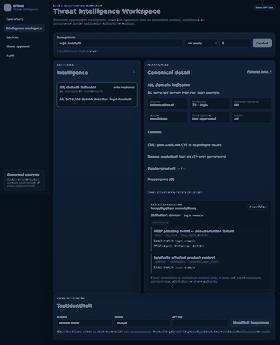

# DTMO Product Screenshot Catalogue

**Status:** governed screenshot promotion in progress; UI-06 published  
**Screenshot type:** actual DTMO runtime UI with sanitized deterministic fixtures unless a record explicitly states otherwise  
**Evidence classification:** documentation illustration only — not staging acceptance, independent assurance or production evidence

## Capture policy

Screenshots in this directory must come from the real DTMO web application rendered in a supported browser. The documentation capture runner may intercept API calls with synthetic fixtures so that images are deterministic, free from production data and safe to publish in repository documentation.

Synthetic API fixtures do **not** turn a screenshot into a mock-up: the HTML/CSS/JavaScript and interaction surface are the actual DTMO application. Fixture-backed screenshots must always be described as **runtime UI with synthetic fixture data** and must never be presented as proof of live-source connectivity or production-equivalent deployment behavior.

## Standard capture context

- Browser: Chromium through Playwright
- Viewport: 1440 × 1000 for source capture unless a specific responsive example says otherwise
- Data: sanitized synthetic fixture data
- Credentials: no production credentials; documentation-only test identity
- External network calls: blocked or intercepted where practical
- Output: PNG
- Base capture command: `python3 tools/capture_documentation_screenshots.py --base-url <running-dtmo-url> --output docs/visual/screenshots/generated`
- Investigation capture command: `python3 tools/capture_documentation_investigation_screenshots.py --base-url <running-dtmo-url> --output docs/visual/screenshots/generated`

The generated output remains separate from the governed catalogue until review for secrets, personal data, visual correctness and lifecycle labelling is complete.

## Screenshot register

| ID | Product surface | Target image | Current state | Required label |
|---|---|---|---|---|
| UI-01 | Overview / executive dashboard | `overview-dashboard.png` | capture validated; binary promotion pending | runtime UI with synthetic fixture data |
| UI-02 | Intelligence workspace | `intelligence-workspace.png` | capture validated; binary promotion pending | runtime UI with synthetic fixture data |
| UI-03 | Sources & Catalogue | `sources-catalogue.png` | capture validated; binary promotion pending | runtime UI with synthetic fixture data |
| UI-04 | Vulnerability analytics | `vulnerability-analytics.png` | capture validated; binary promotion pending | runtime UI with synthetic fixture data |
| UI-05 | MISP governed workflow | `misp-governed-workflow.png` | dedicated runtime screenshot pending | runtime UI with synthetic fixture data |
| UI-06 | AIL correlation workspace | `ail-correlation-workspace.png` | **published / governed** | runtime UI with synthetic fixture data |
| UI-07 | Visual Analytics | `visual-analytics.png` | capture validated; binary promotion pending | runtime UI with synthetic fixture data |
| UI-08 | Governance frameworks | `governance-frameworks.png` | capture validated; binary promotion pending | runtime UI with synthetic fixture data |
| UI-09 | Administration / RBAC | `administration-rbac.png` | capture validated; binary promotion pending | runtime UI with synthetic fixture data |
| UI-10 | Audit / correlation surface | `audit-correlation.png` | dedicated runtime screenshot pending | runtime UI with synthetic fixture data |

## Published screenshot: UI-06 AIL correlation

**Review record**

- source capture: Documentation Screenshot Artifact Gate run #5, exact head `789e94c5c842e9a64f210b8e9201cfe79536bc36`;
- source artifact digest: `sha256:43bb5378ec6952daf142c6dff8a7f378dc5faa6e35c6ae89e9495331698c0068`;
- capture mode: `synthetic-fixture`;
- product surface: actual DTMO Intelligence Workspace / AIL correlation panel;
- raw-content fixture boundary: `raw_content_exposed = false`;
- publication: optimized documentation copy; source artifact remains the capture-of-record;
- evidence boundary: documentation illustration only.

## Dedicated MISP and audit captures

A diagram or API contract must never be promoted as a product screenshot. MISP and audit/correlation remain pending until the capture implementation identifies an actual rendered governed surface rather than manufacturing a conceptual screen.

## Review record required before publication

For each image promoted from `generated/` into this governed catalogue, record image ID/filename, captured commit/release, capture date, browser/viewport, capture mode, reviewer, confirmation that no secret/personal/restricted operational data is visible, any redaction, and whether the image remains representative of the current navigation and interaction model.

## Claim boundary

A screenshot can demonstrate what a rendered DTMO product surface looks like. It does not establish that an external feed was reachable, that a vulnerability applies to a local asset, that an outbound share was authorized, that a deployment passed staging, that a penetration test was accepted or that production deployment is approved.

See also `docs/visual/DOCUMENTATION_VISUAL_STANDARD.md`, `docs/architecture/SYSTEM_WORKFLOWS.md`, `docs/product/PRODUCT_GUIDE.md`, `docs/user/USER_GUIDE.md` and `docs/administration/ADMINISTRATOR_GUIDE.md`.
