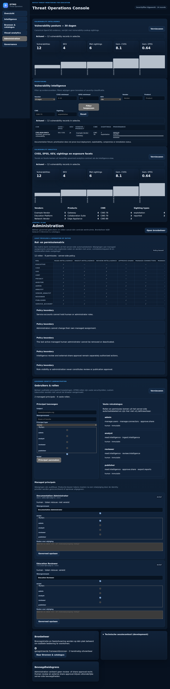

# DTMO Product Screenshot Catalogue

**Status:** base runtime capture validated; UI-01–09 published / governed; UI-10 capture validated / repository promotion pending  
**Screenshot type:** actual DTMO runtime UI with sanitized deterministic fixtures unless a record explicitly states otherwise  
**Evidence classification:** documentation illustration only — not staging acceptance, independent assurance or production evidence

## Capture policy

Screenshots in this directory must come from the real DTMO web application rendered in a supported browser. The documentation capture runner may intercept API calls with synthetic fixtures so that images are deterministic, free from production data and safe to publish in repository documentation.

Synthetic API fixtures do **not** turn a screenshot into a mock-up: the HTML/CSS/JavaScript and interaction surface are the actual DTMO application. Fixture-backed screenshots must always be described as **runtime UI with synthetic fixture data** and must never be presented as proof of live-source connectivity or production-equivalent deployment behavior.

## Standard capture context

- Browser: Chromium through Playwright
- Viewport: 1440 × 1000 for source capture unless a specific responsive example says otherwise
- Data: sanitized synthetic fixture data
- Credentials: no production credentials; documentation-only test identity
- External network calls: blocked or intercepted where practical
- Output: PNG
- Base capture command: `python3 tools/capture_documentation_screenshots.py --base-url <running-dtmo-url> --output docs/visual/screenshots/generated`
- Investigation capture command: `python3 tools/capture_documentation_investigation_screenshots.py --base-url <running-dtmo-url> --output docs/visual/screenshots/generated`

## Screenshot register

| ID | Product surface | Target image | Current state | Required label |
|---|---|---|---|---|
| UI-01 | Overview / executive dashboard | `overview-dashboard.png` | **published / governed** | runtime UI with synthetic fixture data |
| UI-02 | Intelligence workspace | `intelligence-workspace.png` | **published / governed** | runtime UI with synthetic fixture data |
| UI-03 | Sources & Catalogue | `sources-catalogue.png` | **published / governed** | runtime UI with synthetic fixture data |
| UI-04 | Vulnerability analytics | `vulnerability-analytics.png` | **published / governed** | runtime UI with synthetic fixture data |
| UI-05 | MISP governed workflow | `misp-governed-workflow.png` | **published / governed** | runtime UI with synthetic fixture data |
| UI-06 | AIL correlation workspace | `ail-correlation-workspace.png` | **published / governed** | runtime UI with synthetic fixture data |
| UI-07 | Visual Analytics | `visual-analytics.png` | **published / governed** | runtime UI with synthetic fixture data |
| UI-08 | Governance frameworks | `governance-frameworks.png` | **published / governed** | runtime UI with synthetic fixture data |
| UI-09 | Administration / RBAC | `administration-rbac.png` | **published / governed** | runtime UI with synthetic fixture data |
| UI-10 | Audit / correlation surface | `audit-correlation.png` | capture validated; repository promotion pending | runtime UI with synthetic fixture data |

## Published base runtime screenshots

**Review record for UI-01–04 and UI-07–09**

- source capture: Documentation Screenshot Artifact Gate run #8, exact head `5563e3cbfaa46df6749420347f05315b4295e7dd`;
- source artifact: `9247117828`, `dtmo-documentation-screenshots`;
- source artifact digest: `sha256:e423efe5e1309993b267247aecbc0cec88bce9d8a4f84e0e1d60cc8e79f2f51a`;
- promotion workflow copied only the seven reviewed PNGs from that exact artifact;
- capture mode: `synthetic-fixture`;
- reviewer check: navigation/context legible; no production credentials, raw secrets or unnecessary personal data visible;
- evidence boundary: documentation illustration only.

## Published screenshot: UI-06 AIL correlation

**Review record**

- source capture: Documentation Screenshot Artifact Gate run #5, exact head `789e94c5c842e9a64f210b8e9201cfe79536bc36`;
- source artifact digest: `sha256:43bb5378ec6952daf142c6dff8a7f378dc5faa6e35c6ae89e9495331698c0068`;
- capture mode: `synthetic-fixture`;
- product surface: actual DTMO Intelligence Workspace / AIL correlation panel;
- raw-content fixture boundary: `raw_content_exposed = false`;
- evidence boundary: documentation illustration only.

## Dedicated MISP and audit captures

UI-05 is published from the reviewed exact-head capture.

**Review record for UI-05**

- source capture: Documentation Screenshot Artifact Gate run #11, exact head `0bfc126d60225cd669b2aa4a4204243ecd7a5914`;
- source artifact: `9247749318`, `dtmo-documentation-screenshots`;
- source artifact digest: `sha256:2982c4bd8c13d65d2a2ee385883f8e33a73ef8f17408286ba39e247de3976808`;
- image SHA-256: `f10518d60c225d7278ab804e6a6a2290a4410550fc811ea94850bb138c11cdbd`;
- dimensions: 1440 × 1000; browser: Chromium/Playwright;
- capture mode: actual runtime UI with sanitized synthetic fixture data;
- reviewer check: governed read/export controls and claim boundaries are legible; no production credentials, secrets or unnecessary personal data are visible;
- execution boundary: the capture does not execute outbound MISP export and does not prove live MISP connectivity;
- evidence boundary: documentation illustration only.

UI-10 uses the existing read-only auditor surface. Its deterministic runtime capture is validated; repository image promotion remains a separate governed step.

A diagram or API contract must never be promoted as a product screenshot.

## Review record required before publication

For each future image promoted from `generated/` into this governed catalogue, record image ID/filename, captured commit/release, capture date, browser/viewport, capture mode, reviewer, confirmation that no secret/personal/restricted operational data is visible, any redaction, and whether the image remains representative of the current navigation and interaction model.

## Claim boundary

A screenshot can demonstrate what a rendered DTMO product surface looks like. It does not establish that an external feed was reachable, that a vulnerability applies to a local asset, that an outbound share was authorized, that a deployment passed staging, that a penetration test was accepted or that production deployment is approved.

See also `docs/visual/DOCUMENTATION_VISUAL_STANDARD.md`, `docs/architecture/SYSTEM_WORKFLOWS.md`, `docs/product/PRODUCT_GUIDE.md`, `docs/user/USER_GUIDE.md` and `docs/administration/ADMINISTRATOR_GUIDE.md`.
